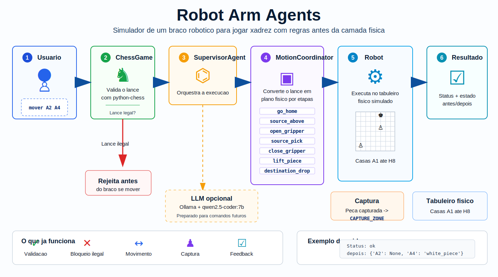

# Arquitetura



## Visao Geral

O projeto separa regras de xadrez, planejamento da missao fisica e execucao do robo.

```txt
Usuario
  ->
main.py
  ->
ChessGame
  ->
SupervisorAgent
  ->
JointAgents
  ->
MotionCoordinator
  ->
SupervisorAgent
  ->
MockRobot / ArduinoRobot futuro
  ->
Feedback
  ->
SupervisorAgent recebe feedback
```

## Responsabilidades

`ChessGame`

- recebe comandos como `mover A2 A4`
- valida regras de xadrez com `python-chess`
- sabe de quem e a vez
- detecta lance ilegal
- detecta movimento normal
- detecta captura
- detecta xeque e xeque-mate
- nao fala com servo nem Arduino

`SupervisorAgent`

- recebe uma intencao ja validada pelo xadrez
- le o estado do robo
- chama os agentes das articulacoes
- recebe o plano do coordenador
- valida seguranca final
- envia o plano ao robo
- recebe feedback

`JointAgents`

- `BaseJointAgent`: rotacao horizontal
- `ShoulderJointAgent`: subida e descida principal
- `ElbowJointAgent`: alcance do braco
- `WristJointAgent`: alinhamento da garra
- `GripperAgent`: abrir e fechar garra

`MotionCoordinator`

- recebe propostas dos agentes
- detecta conflitos simples
- usa `board_positions.json`
- monta plano de movimento normal
- monta plano de captura

`MockRobot`

- simula servos
- simula o tabuleiro fisico
- simula pegar e soltar peca
- simula descarte em `CAPTURE_ZONE`
- retorna feedback verificavel

## Movimento Normal

Comando:

```txt
mover A2 A4
```

Fluxo:

```txt
1. main.py recebe o comando
2. ChessGame valida o lance
3. ChessGame retorna:
   origem = A2
   destino = A4
   tipo = normal
4. SupervisorAgent recebe a intencao
5. JointAgents sugerem movimentos
6. MotionCoordinator monta o plano
7. MockRobot executa
8. Feedback confirma antes/depois
```

Plano fisico:

```txt
go_home
move_to_source_above
open_gripper
move_to_source_pick
close_gripper
lift_piece
move_to_destination_above
move_to_destination_drop
open_gripper
clear_destination
go_home
```

## Lance Invalido

Comando:

```txt
mover A2 A5
```

Resultado:

```txt
ChessGame rejeita o lance
SupervisorAgent nao e chamado
MockRobot nao se mexe
```

## Captura

Exemplo:

```txt
mover E2 E4
mover D7 D5
mover E4 D5
```

O `ChessGame` identifica que `E4 -> D5` e captura.

O plano fisico faz duas missoes:

```txt
1. remover a peca capturada de D5
2. levar a peca capturada para CAPTURE_ZONE
3. pegar a peca atacante em E4
4. mover a peca atacante para D5
```

Plano fisico de captura:

```txt
go_home
move_to_captured_above
open_gripper
move_to_captured_pick
close_gripper
lift_captured_piece
move_to_capture_zone
release_captured_piece
move_to_source_above
move_to_source_pick
close_gripper
lift_piece
move_to_destination_above
move_to_destination_drop
open_gripper
clear_destination
go_home
```

Feedback esperado:

```txt
antes: {'E4': 'white_pawn', 'D5': 'black_pawn'}
depois: {'E4': None, 'D5': 'white_pawn'}
capturadas: ['black_pawn']
```

## Mapa Fisico

Arquivo:

```txt
app/data/board_positions.json
```

Contem:

```txt
HOME
CAPTURE_ZONE
A1_ABOVE / A1_PICK / A1_DROP
...
H8_ABOVE / H8_PICK / H8_DROP
```

Os valores atuais sao aproximacoes para simulacao. No hardware real, esses valores precisam ser calibrados.

## Estado Atual

```txt
OK  movimento normal
OK  bloqueio de lance ilegal
OK  deteccao de captura
OK  captura fisica simulada
OK  tabuleiro A1-H8 simulado
PENDENTE  ArduinoRobot
PENDENTE  persistencia da partida entre execucoes separadas
PENDENTE  calibracao fisica real
```
