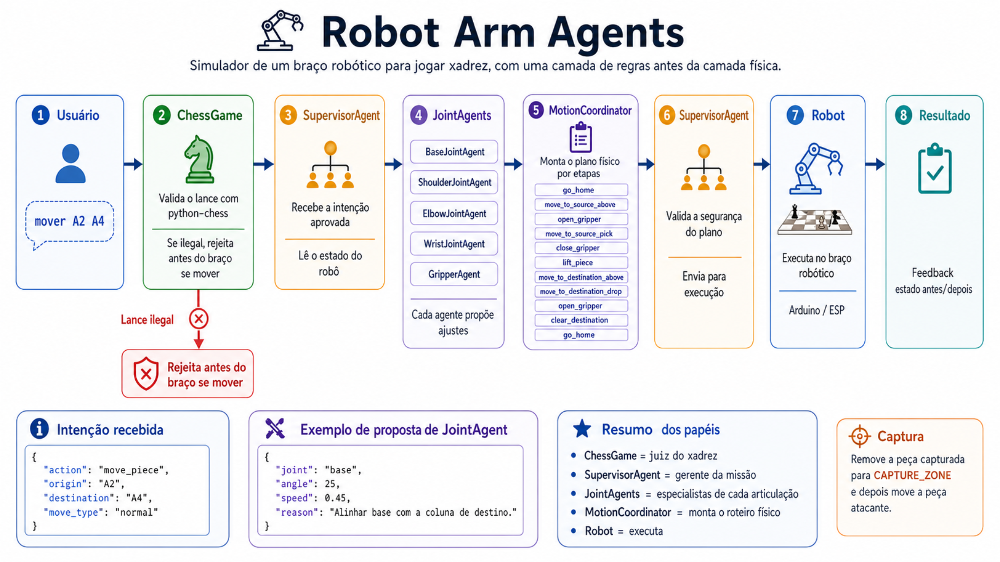

# Robot Arm Agents

Simulador de um braco robotico para jogar xadrez, com uma camada de regras antes da camada fisica.



O fluxo atual e:

```txt
Usuario
  ->
main.py
  ->
ChessGame
  ->
SupervisorAgent
  ->
JointAgents
  ->
MotionCoordinator
  ->
SupervisorAgent
  ->
MockRobot
  ->
Feedback
```

## O Que Funciona

- Validacao de lances com `python-chess`.
- Bloqueio de lances ilegais antes do braco se mexer.
- Movimento normal de uma peca.
- Captura simulada com remocao da peca capturada para `CAPTURE_ZONE`.
- Plano fisico por etapas.
- Tabuleiro fisico simulado com casas `A1` ate `H8`.
- Feedback com estado antes/depois da origem e destino.
- Configuracao opcional de LLM local via Ollama com `qwen2.5-coder:7b`.

## Estrutura

```txt
robot_arm_agents/
|-- README.md
|-- ARCHITECTURE.md
|-- agents_config.json
|-- requirements.txt
|-- .env.example
|
`-- app/
    |-- main.py
    |
    |-- chess/
    |   `-- chess_game.py
    |
    |-- supervisor/
    |   `-- supervisor_agent.py
    |
    |-- joints/
    |   |-- base_joint_agent.py
    |   |-- shoulder_joint_agent.py
    |   |-- elbow_joint_agent.py
    |   |-- wrist_joint_agent.py
    |   `-- gripper_agent.py
    |
    |-- coordinator/
    |   `-- motion_coordinator.py
    |
    |-- robot/
    |   `-- mock_robot.py
    |
    |-- llm/
    |   `-- ollama_client.py
    |
    |-- config/
    |   `-- env_loader.py
    |
    `-- data/
        `-- board_positions.json
```

## Instalar

```bash
pip install -r requirements.txt
```

## Configuracao

Copie `.env.example` para `.env` ou mantenha o `.env` atual:

```txt
OLLAMA_ENABLED=true
OLLAMA_BASE_URL=http://localhost:11434
OLLAMA_MODEL=qwen2.5-coder:7b
LLM_FALLBACK_TO_RULE_PARSER=true
```

O fluxo principal com `ChessGame` nao depende do Ollama. O LLM fica preparado para interpretacao de comandos em camadas futuras.

## Rodar

Movimento normal:

```bash
python app/main.py "mover A2 A4"
```

Esperado:

```txt
Status: ok
peca_movida: True
antes: {'A2': 'white_piece', 'A4': None}
depois: {'A2': None, 'A4': 'white_piece'}
```

Lance ilegal:

```bash
python app/main.py "mover A2 A5"
```

Esperado:

```txt
Status: rejected
Mensagem: Lance invalido no xadrez: A2 -> A5
```

## Captura

A captura funciona no simulador quando a partida e mantida no mesmo processo.

Exemplo de sequencia:

```txt
mover E2 E4
mover D7 D5
mover E4 D5
```

Resultado esperado da captura:

```txt
antes: {'E4': 'white_piece', 'D5': 'black_piece'}
depois: {'E4': None, 'D5': 'white_piece'}
capturadas: ['black_piece']
```

Observacao: executar `python app/main.py "..."` sempre cria uma partida nova. Para testar sequencias completas, use o mesmo `ChessGame` e o mesmo `SupervisorAgent` no mesmo processo.

## Mapa Fisico

`app/data/board_positions.json` contem:

- `HOME`
- `CAPTURE_ZONE`
- casas `A1` ate `H8`
- para cada casa: `ABOVE`, `PICK`, `DROP`

Os valores atuais sao interpolados para simulacao. No braco real, devem ser substituidos por calibracao medida.

## Proximos Passos

- Criar um modo interativo para manter a partida entre varios comandos.
- Persistir estado da partida e do tabuleiro em arquivo.
- Adicionar `app/robot/arduino_robot.py`.
- Calibrar posicoes reais do braco.
- Adicionar regras de colisao e limites fisicos mais fortes.
- Criar testes automatizados.
